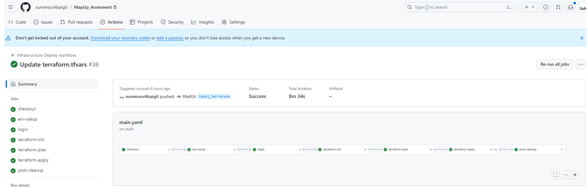
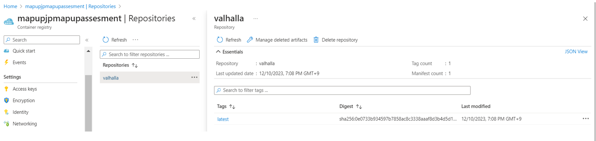
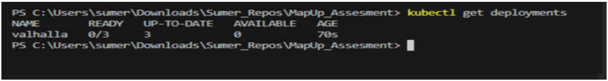
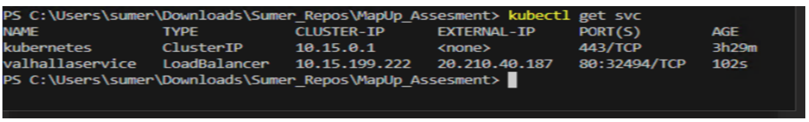

# Infra kubernetes Project
Task : Set up a nginx webpage server on Azure using Docker, Kubernetes, and Terraform. The setup should be scalable, include load balancers, and be accessible for routing requests

## Task 1: Azure Setup using Terraform
- Created modules of AKS Cluster , ACR , and Virtual Network and Virtual machine (For Github Action Runner)

- Created the Infrastructure Pipeline using and Github Actions and deployed all the resources in the Azure

  

## Task 2: Docker Configuration
- Created the Dokerfile for the Valhalla Server
- Uploaded the Docker Image in the created Azure Container Registry

   

- <small>(Note: While creating the Dockerfile facing the problem in docker desktop , Hence I have used the read made Docker image from https://hub.docker.com/r/reinventinggeospatial/valhalla and stored it to the container Registry)

## Task 3: Kubernetes Deployment
- AKS cluster is deployed with systempool and one userpool
- AKS Authentication is set with Azure AD Authentication with Azure RBAC
- -	Contributor access is provided to Azure AD ‘Admin’ group
- Created the Kubernetes Deployment with the 3 Replicas
    
- Created the load balancer Kubernetes Service
    

   <small>(Note : The Pods are not getting ready due to back-off restarting, As per the logs checked Images is successfully fetching from the ACR. Cheking the issue)

## Task 4: Load Balancing and Scalability
- While deploying the cluster , The Public Load balancer is deployed. AKS cluster is access via this LB
- Scalabilty : node pool Systempool vm type is set as VirtualMachineScaleSets min 1 and max 2

## Task 5: Networking and Security
- As current infrastructure , the gateway we are using public load balancer.
- As Network and Security wise , 
    -	We can create a Hub and Spoke network and manage and secure the traffic via Azure Firewall with layer 7 security
    -	Additionally if we have multiple application or if we are using the mircroservices , we can use the Ingress Service with Context based/DNS based routing
    -	We can also use the SSL certificates also on the ingress level

## Task 6: Monitoring and Logging
- We can implement the monitoring and logging using the Container Monitoring agent in the Cluster
- We can search and set up the alerts by configuring the Log anyalictics workspace.

